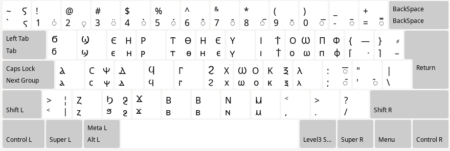

# Coptic keyboard layout for XKB 

Do you often find yourself wishing for a way to easily input [Coptic characters](https://en.wikipedia.org/wiki/Coptic_script)? Are you a Linux user? Do you still use Xorg in 2024? If you answered yes to all of these questions, this repository might be just the thing you need.

> [!CAUTION]
> Neither the layout nor its implementation were designed by somebody actually qualified for the task. This project is work-in-progress. If you have suggestions on how to improve this mess, please open an issue or submit a PR.

## Layout

The layout is based on QWERTY, with key assignments guided mostly by phonetic considerations. 



Note:

* `v` and `b` are both mapped to ⲃ (this might change in the future)
* right alt (`AltGr`) is used to input some characters. For example, the key labeled `t` normally produces a ⲧ, but with right alt you get a ⲑ
* `AltGr` can be combined with `Shift`: `AltGr+Shift+P` produces Ⲫ (uppercase ⲫ)
* the six monograms of coptic alphabet are input using `AltGr`:
    * ⲑ (ⲧϩ), ⲝ (ⲕⲥ), ⲫ (ⲡϩ) are input by combining the first letter of a monogram with `AltGr`: `AltGr+T (ⲧ)` for ⲑ, `AltGr+K (ⲕ)` ⲝ, `AltGr+P (ⲡ)` for ⲫ
    * ⲭ (ⲕϩ), ⲯ (ⲡⲥ), ϯ (ⲧⲓ) are input by combining the **second** letter of a monogram with `AltGr`: `AltGr+H (ϩ)` for ⲭ, `AltGr+S (ⲥ)` ⲯ, `AltGr+I (ⲓ)` for ϯ
* combining diacritics are input by using `AltGr` on the number row keys:
    * `AltGr+Minus` produces combining macron (◌̄), which can be used to mark syllabic consonants like ⲙ̄, ⲛ̄, ⲃ̄, etc.
    * `AltGr+8`, `AltGr+9` and `AltGr+0` produce middle (◌︦), left (◌︤) and right (◌︥) parts of a multi-character overstroke
* `AltGr+Apostrophe` produces a middle dot (·), `AltGr+Shift+Apostrophe` produces coptic morphological divider (⳿)

## Installation

1. Copy file `coptic.xkb` into `/usr/share/X11/xkb/symbols/cop`
2. Add the layout into `<layoutList>` block of `/usr/share/X11/xkb/rules/evdev.xml`
```xml
<layout>
  <configItem>
	<name>coptic</name>
	<shortDescription>coptic</shortDescription>
	<description>coptic</description>
	<languageList><iso639Id>cop</iso639Id></languageList>
  </configItem>
</layout>
```
3. Use `setxkbmap` to set up your layouts, for example:
 ```shell
 $ setxkbmap us,cop -option lv3:ralt_switch -option grp:caps_toggle
 ```

For more info on `setxkbmap` and Xorg keyboard configuration in general, see [ArchWiki](https://wiki.archlinux.org/title/Xorg/Keyboard_configuration#Using_setxkbmap).

## Alternatives

See [vwbusguy/ibus-coptic](https://github.com/vwbusguy/ibus-coptic) for [IBus](https://wiki.archlinux.org/title/IBus) implementation of Coptic input. 

See [Antinoou](https://www.evertype.com/fonts/coptic/) page on [evertype.com](https://www.evertype.com) for another option that uses [SCIM](https://wiki.archlinux.org/title/Smart_Common_Input_Method).
