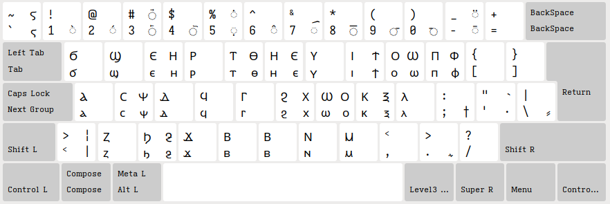

# Coptic keyboard layout for XKB 

Do you often find yourself wishing for a way to easily input [Coptic characters](https://en.wikipedia.org/wiki/Coptic_script)? Are you a Linux user? Do you still use Xorg in 2024? If you answered yes to all of these questions, this repository might be just the thing you need.

> [!CAUTION]
> Neither the layout nor its implementation were designed by somebody actually qualified for the task. This project is work-in-progress. If you have suggestions on how to improve this mess, please open an issue or submit a PR.

## Layout

The layout is based on QWERTY, with key assignments guided mostly by phonetic considerations. 



Note:

* right alt is used to input some characters. For example, the key labeled `t` normally produces a ⲧ, but with right alt you get a ⲑ
* `v` and `b` are both mapped to ⲃ

## Installation

1. Copy file `copt` into `/usr/share/X11/xkb/symbols/`
2. Add the layout into `<layoutList>` block of `/usr/share/X11/xkb/rules/evdev.xml`
```xml
<layout>
  <configItem>
	<name>coptic</name>
	<shortDescription>coptic</shortDescription>
	<description>coptic</description>
	<languageList><iso639Id>copt</iso639Id></languageList>
  </configItem>
</layout>
```
3. Use `setxkbmap` to set up your layouts, for example:
 ```shell
 $ setxkbmap us,copt -option lv3:ralt_switch -option grp:caps_toggle
 ```

For more info on `setxkbmap` and Xorg keyboard configuration in general, see [ArchWiki](https://wiki.archlinux.org/title/Xorg/Keyboard_configuration#Using_setxkbmap).

## Alternatives

See [vwbusguy/ibus-coptic](https://github.com/vwbusguy/ibus-coptic) for IBus implementation of Coptic input. 
